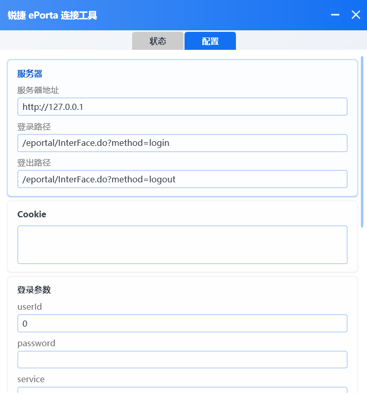

# Ruijie ePorta Tool (WPF)

[](https://dotnet.microsoft.com/)
[](https://www.microsoft.com/windows)
[](LICENSE)

锐捷 ePorta Web 认证自动登录/断开工具 —— WPF 图形界面版本

> 🤖 本项目 100% 由 AI 辅助生成，无手写代码。

基于 [Red_lnn](https://github.com/Redlnn) 的 [Ruijie-ePorta-Tool](https://github.com/Redlnn/Ruijie-ePorta-Tool)（Python 版）重写为 WPF + VB.NET，提供更友好的图形界面操作体验。

> ⚠ 原项目已于 2023 年 10 月归档，本项目为其 WPF 重写版本，功能与原项目一致。

## 目录

- [功能特性](#功能特性)
- [截图展示](#截图展示)
- [下载使用](#下载使用)
- [构建方法](#构建方法)
- [配置说明](#配置说明)
- [常见问题](#常见问题)
- [项目架构](#项目架构)
- [权责声明](#权责声明)
- [致谢](#致谢)
- [许可证](#许可证)

## 功能特性

- 图形化界面操作，支持状态监控、连接/断开、配置管理
- 自动检测网络连通状态，实时显示连接结果
- 支持断线自动重连（可配置间隔）
- 支持开机自启（Windows 注册表自启）
- 事件日志实时显示，同时写入本地日志文件
- 网络监控线程后台运行，不阻塞 UI
- 使用 PCL2 风格的自定义控件和动画系统

## 截图展示

| 状态页面 | 配置页面 |
|:---:|:---:|
|  |  |

## 下载使用

### 方式一：下载预编译版本

前往 [Releases](https://github.com/angelica-bz/Ruijie-ePorta-Tool-WPF-/releases) 页面下载最新版 `Ruijie ePorta Tool.exe`，直接运行即可。

### 方式二：自行构建

见下方 [构建方法](#构建方法)。

### 使用步骤

1. 运行 `Ruijie ePorta Tool.exe`
2. 切换到「配置」页面，填写校园网服务器地址、登录参数等
3. 点击「保存配置」
4. 切换到「状态」页面，点击「连接」进行认证

配置文件 `config.yml`和日志文件夹`logs`会在首次运行时自动生成在 exe 所在目录。

## 构建方法

> 需要 Visual Studio 2022 和 .NET Framework 4.8。

1. 克隆本仓库
   ```bash
   git clone https://github.com/angelica-bz/Ruijie-ePorta-Tool-WPF-.git
   ```
2. 用 Visual Studio 2022 打开 `Ruijie-WPF.sln`
3. 生成解决方案（`Ctrl+Shift+B`）
4. 在 `Ruijie-WPF\bin\` 目录下找到 `Ruijie ePorta Tool.exe`

## 配置说明

> 📺 视频教程：[【Mac/Windows/Linux通用】如何使用一个小工具自动连接锐捷认证校园网 ](https://www.bilibili.com/video/BV1TZ4y167b6/?share_source=copy_web&vd_source=3902cdf7d0b1352b0acab183a8cc10b4)

配置文件 `config.yml` 各字段含义：

| 字段 | 说明 | 示例 |
|------|------|------|
| `url: server` | 认证服务器基础 URL | `http://127.0.0.1` |
| `url: login` | 登录接口路径 | `/eportal/InterFace.do?method=login` |
| `url: logout` | 登出接口路径 | `/eportal/InterFace.do?method=logout` |
| `cookie` | HTTP 请求 Cookie | 从浏览器捕获 |
| `login_data: userId` | 校园网账号 | `2021000001` |
| `login_data: password` | 密码（加密后） | `123456` |
| `login_data: service` | 运营商选择 |  |
| `login_data: queryString` | 认证查询参数 | |
| `login_data: operatorUserId` | 运营商账号（可选） | |
| `login_data: operatorPwd` | 运营商密码（可选） | |
| `login_data: validcode` | 验证码（如需） | |
| `login_data: passwordEncrypt` | 是否加密密码 | `true` / `false` |
| `headers` | 自定义 HTTP 请求头 | `Referer` |
| `function: auto_reconnect` | 是否启用断线自动重连 | `true` / `false` |
| `function: reconnect_interval` | 检测 / 重连间隔（秒） | `1` |
| `function: disconnect_network` | 是否开启断网功能 | `true` / `false` |
| `function: check_school_network` | 是否检查校园网环境 | `true` / `false` |

## 常见问题

### Q: 点击「连接」后提示"登录失败"？

检查配置页中的服务器地址是否正确，以及 `userId`、`password`、`queryString` 是否与校园网认证页面一致。

### Q: 如何获取 queryString？

登录校园网认证页面后，打开浏览器开发者工具（F12）→ Network 标签，找到登录请求，查看 Form Data 中的 `queryString` 字段。

### Q: 配置文件在哪里？

配置文件 `config.yml` 与 `Ruijie ePorta Tool.exe` 位于同一目录。

### Q: 开机自启无效？

请以管理员身份运行程序后再开启此功能；或手动将快捷方式放入 `shell:startup` 文件夹。

### Q: 杀毒软件报毒？

本程序为开源项目，可审查全部源代码。报毒属于误报，请在杀毒软件中添加信任。

### Q: 支持哪些 Windows 版本？

Windows 7 SP1 及以上，需安装 .NET Framework 4.8。

## 项目架构

```
Ruijie-WPF/
├── App.xaml(.vb)              # 应用程序入口与资源定义
├── FormMain.xaml(.vb)          # 主窗口
├── Controls/                  # 自定义 UI 控件
│   ├── MyButton                # 按钮（带动画）
│   ├── MyCard                  # 卡片容器（折叠/展开动画）
│   ├── MyCheckBox              # 复选框
│   ├── MyDropShadow            # 自定义投影
│   ├── MyHint                  # 提示栏
│   ├── MyIconButton            # 图标按钮
│   ├── MyIconTextButton        # 图标+文字按钮
│   ├── MyListItem              # 列表项（单选/复选）
│   ├── MyLoading               # 加载动画
│   ├── MyScrollBar/Viewer      # 自定义滚动条
│   ├── MyTextButton            # 文字按钮
│   ├── Behaviors/              # 接口定义
│   └── ExtensionMethods.vb     # 扩展方法
├── Modules/                   # 核心逻辑模块
│   ├── ModBase.vb              # 基础工具（颜色/路径/线程/日志）
│   ├── ModAnimation.vb        # 动画引擎（缓动函数/动画组）
│   ├── ModConfig.vb            # YAML 配置解析
│   ├── ModNetwork.vb           # HTTP 网络请求
│   ├── ModJson.vb               # JSON 响应解析
│   ├── ModMonitor.vb           # 网络状态监控
│   └── ModStartup.vb           # 开机启动管理
├── Pages/                      # 页面
│   ├── PageStatus              # 状态页（连接/断开/日志）
│   └── PageConfig              # 配置页（服务器/登录参数）
└── Images/
    └── icon.ico                # 应用图标
```

## 权责声明

- 本程序仅供研究学习之用，无意对锐捷的认证机制做任何抵触性行为
- 本程序不可用于任何商业和不良用途，否则责任自负
- 本程序不保证在任何环境下能够通过，也不保证能按时按要求改进本程序
- 本程序不保证经过严格测试对机器无害，由于未知的使用环境或不当使用对计算机造成的损害，责任由使用者全部承担

## 致谢

- [Red_lnn](https://github.com/Redlnn) — 原版 Python 项目 [Ruijie-ePorta-Tool](https://github.com/Redlnn/Ruijie-ePorta-Tool)
- [龙腾猫跃](https://github.com/Meloong-Git) — [Plain Craft Launcher (PCL)](https://github.com/Meloong-Git/PCL) 的 UI 控件与动画系统

## 许可证

本项目基于原项目采用 [AGPL-3.0](LICENSE) 许可证。
